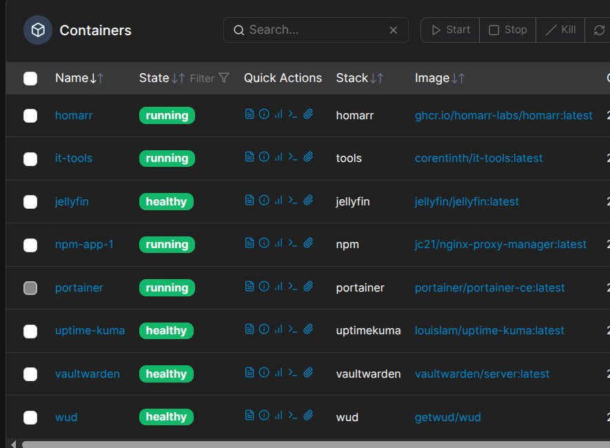
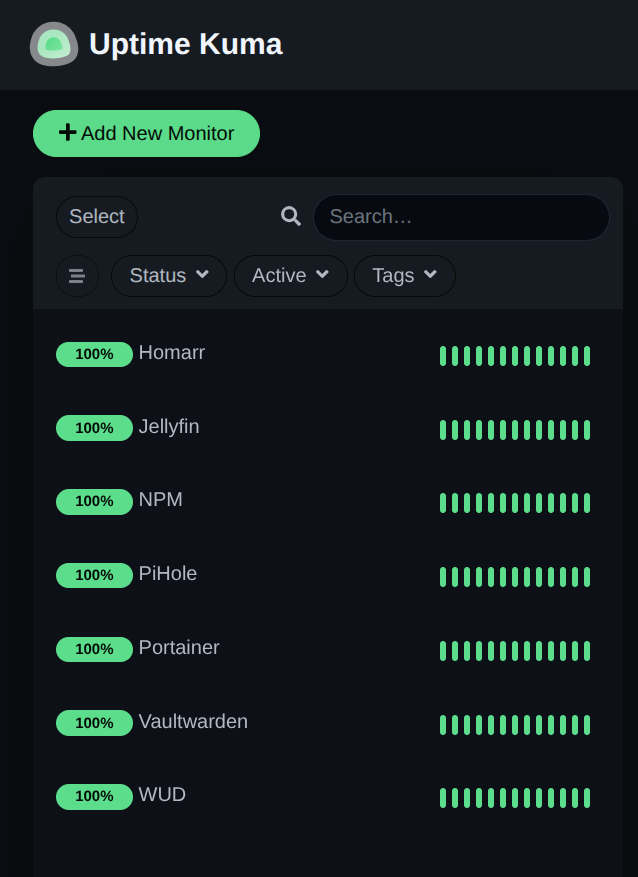
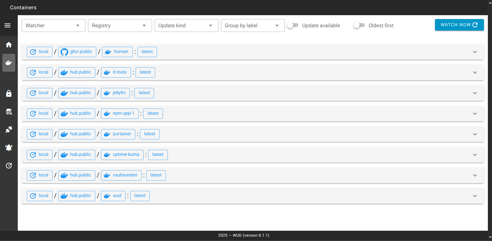

# Introduction

Welcome to my new journey on selfhosting on my HomaLab. I started this journey to learn and gain hands on knowledge on deploying, monitoring, and hosting all to showcase my skills on becoming a System Engineer/Architect. Each file contains services that I am hosting, as well documentation on how it's being ran.

# The Why

I'm currently an IT support analyst working towards my career goal as mentioned on my Introduction. I hold both AWS and Azure certification but lack hands on experience to be job ready. One of my mentors provided me with a RasberriPI to start getting my hands on deploying a linux server and just deploy whatever I was curious. It all started with a simple PiHole set up to learn how a DNS server work, then from there I fell through a rabit hole. Now I am hosting monitoring tools, media, password managers, and more to expand. My tought processes was "If cloud technology is just using somebody's data center, why not learn how on-prem data center works"

# Hardware
<dl>
  <dt>Dell Inspiron 15</dt>
    <dd>- 500GB SSD</dd>
    <dd>- 4GB RAM</dd>
    <dd>- Ubuntu Server</dd>
    <dd>- Docker engine</dd>

  <dt>RasberryPI 2</dt>
    <dd>- 64GB microSD</dd>
    <dd>- 1GB RAM</dd>
    <dd>- Ubuntu Server</dd>
    <dd>- Docker Engine</dd>
</dl>

# Documentation

Here is a breakdown of how my server archicture is set up

# What services I am running?

I decided to approach a very minimal, simple approach, and rich feature to play with. As well to learn the basic on deploying, hosting, monitor and update. Here are the services I am running and what I gained from hosting it.

# Portainer

Wanted to have something to manage all my containers as they grow. I stummbled on Portainer. It checked my requirement, easy, minimal and community driven. I use it to look over logs if something goes wrong and making sure the networks and volumes are properly attached to each docker container I spin up. Some features that I don't use personally for example stacks and secrets. I understand it makes deployment easy but I wanted to utilize VCS like github to store my docker compose files and use a secret manager to manage my secret to be more enterpise ready.

# Uptime Kuma

Next up is Uptime Kuma. Now Portainer manages or centralizes my containers but it had one challange. Notifying me if something goes down. I needed a service that will notify me via a medium like Discord or SMTP. During my research I found Uptime Kuma. It was the top recommended container to handle notifications if something goes down. I love how I can utilize a combination of Uptime Kuma and Portainer. For example, if one service goes down, uptime kuma will send me a notification via Discord (easiest way to set up) then I go into Portainer and look over the affected container logs and troubleshoot the root cause. 

# WUD (Whats Up Docker)

Biggest question I had. How am I going to know when to update my Docker Image? For a while I was logging in to each container maybe every 2 days to check but that ended up being time consuming. I found one solution, watchtower in which for a while it worked but then it stopped working when I updated my Docker Engine. Turns out, that project has not been worked on in over 3 years so now back to square one. I did my research and found a very simple but very effective tool called WUD. It notifies my if a Docker container needs to be updated. Since I already had a Discord channel to notify from Uptime Kuma, I just deployed it using the same webhook to keep the notification under one channel. Now each time a new image update comes out, I get notified. I dont have automatic update just so I can test the new update to make sure it's stable and not break anything in the network.

# PiHole

My very first project. When my mentor provided me with a RasberryPI 2 to start off my learning journey, the very first thing I deployed was PiHole. Very well known DNS Ad-Blocker that can be deployed network wide once configuring DNS setting via router. I wanted to add an extra layer of security to my network and learned about PiHoe's ad and malware blocking features. Configured it directly to the OS since it's on a seperate server to have a dedicated box. What I learned from this project was how DNS works. I have it configured where it acts as a recursive DNS where it directly asks the root DNS server with domain request from my network and caches it locally. I have Uptime Kuma sending health checks every 60 seconds to make sure my DNS server is alwasy up and running. If my DNS server goes down, my network can't communicate.

# Vaultwarden

Trying to remember all my admin credentials and making sure each of them are unique and strong was a big challange. For a while I was storing them on a note app on my iPhone. However after a while I tought to myself, what if my phone goes down, lost or stolen. How am I going to log in if the passwords are random generated to keep them secure? The solution a password manager. Now I could had went to Lastpass or bitwarden, paid a subscription and have it hosting somewhere in the cloud. But due to recent breaches I was a bit weary. Sure nothing in the internet is ever safe but figured having a self hosting password manager was more secure since it's not exposed publicly. That is when I found Vaultwarden. A fork version of Bitwarden in which I use to manage all my password. What's neat about it, it integrates with Bitwarden so the browser extension and phone app will work flawlesly. One cool feature I use on both my phone's and wife's phone if we create an account and store new password, it will auto sync once we connect to our home network. Which checks my original criteria, simple, minimal and feature rich. Now I can't really showcase a screenshot of my Vaultwarden due to sensative passwords. But when I talk about Homarr and show a screenshot, Vaultwarden will show as a running container.

# Jellyfin

Wanted to configure and manage my own Media server since I have a bunch of DVDs around my house. This was a big project for me since managing users, updates, media management and making sure it's up and running is a big task for someone starting out like me. However since I already configured monitoring tools like Uptime Kuma and WUD, I can keep it up and running so my family can watch movies we buy and own. 

# NGINX Proxy Manager

Now the tie all factor. A proxy manager. For a while I was going into my server's URL by typing in the IP address and port number. Try to remember which was which was a task. Wanted to have a FQDN to access my server locally and have SSL certs as well without exposing to the internet. That is where I found NGINX Proxy Manager. Using DNS Challange from my Cloudflare domain I can keep my HomeLab private and still have SSL cert. With PiHole acting as my DNS Server, I update my DNS entry to make sure it knows where to point if I type something like monitor.homelab.com (not a real FQDN)

# Homarr

I wanted to deploy a service that acts as a homepage for my server. Like all in one site. I deployed Homarr. Here I can centralize everything from how many queries my PiHole blocked, to visualize my container services, to shortcuts to my services and RSS feeds just to keep up with latest tech news.

# How everything connects

I created two seperate docker network. One for my monitoring applications and one for my frontend applications. I decided to design it like that to isolate them so they won't communicate with each other. The way my monitoring network like Uptime Kuma, WUD and Portainer can reach to the front end is by the default Docker Web Socket path. I have Uptime Kuma tracking all my systems to make sure they are up and running. Now for services that are not critical I have a health check of every hour to reduce load but for critical services like my PiHole, Proxy Manager, etc..I have it checking every minute to make sure they are up and running. Subject to change to maybe 5  minutes now that I am getting a bit comfortable now.

