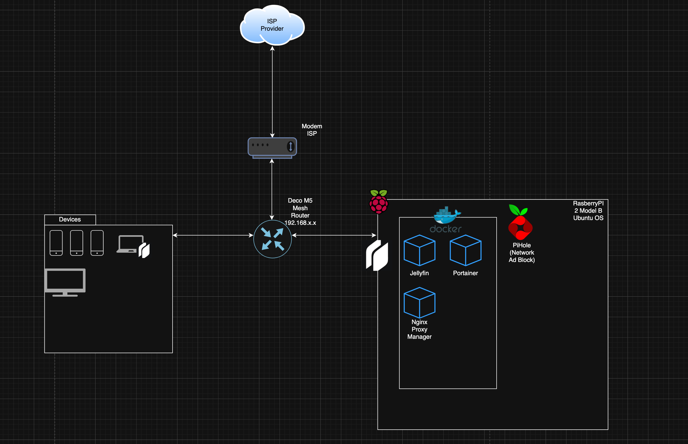

# HomeLab Server

This is a repo documenting and showcasing my new HomeLab journey. I started this journey to learn more about deploying, hosting and monitoring all while gaining valuable skills on becoming a Cloud Engineer/DevOps. Each file contains services that I am running on my HomeLab, as well documentations on how it's being ran.

# Documentation of HomeLab Server

<ul>
  <li>Migrated my media server from OS install to Container using docker compose and successful on mapping current drives to container.</li>
  <li>Started a Proxy Manager Container to handle my local domain routing using combination of PiHole for local DNS and Proxy Manger for future Publicly signed SSL</li>
  <li>PiHole running on OS vs container to act as a network adblocker and act as my recursive DNS lookup but have plans to migrate to docker container</li>
  <li>Running Twingate on server to create a tunnel to connect remotely from anywhere</li>
  <li>Using NPM as my Proxy Manager that only allows connection from within LAN or from Twingate by configuring ACL security groups, pointing to Proxy Endpoint and Twingate Public IP</li>
  <li>On server created a cronjob to update server every sunday at midnight and send an email confirming it has been updated with logs. Plans on changing the frequent to every other day to handle security updates</li>
</ul>

# Future Plans

<ul>
  <li>Deploy a self hosted password manager, to better handle logins locally</li>
  <li>Set up a monitoring tool to track statistics of my server making sure it's always healthy and up</li>
  <li>Add additional server host to migrate my media server, add a homepage, as well run newer service to keep my RasberryPI as a VPN, Monitoring and DNS server</li>

# Tools experience
<ul>
  <li>Docker</li>
  <li>Terraform</li>
  <li>GitHub</li>
</ul>

# End goal
<ul>
  <li>Learn how to create and mantain container by using tools like Portainer</li>
  <li>Learn how to migrate services that was previously installed on the OS to Docker. E.X using docker-compose</li>
  <li>Shift towards K8s and learn core concepts on how to deploy, provision and monitor it</li>
  <li>Understand CI/CD, Version Control and Automation</li>
  <li>Gain valuable skills for a Cloud Engineer/DevOps career</li>
</ul>

# Diagram
